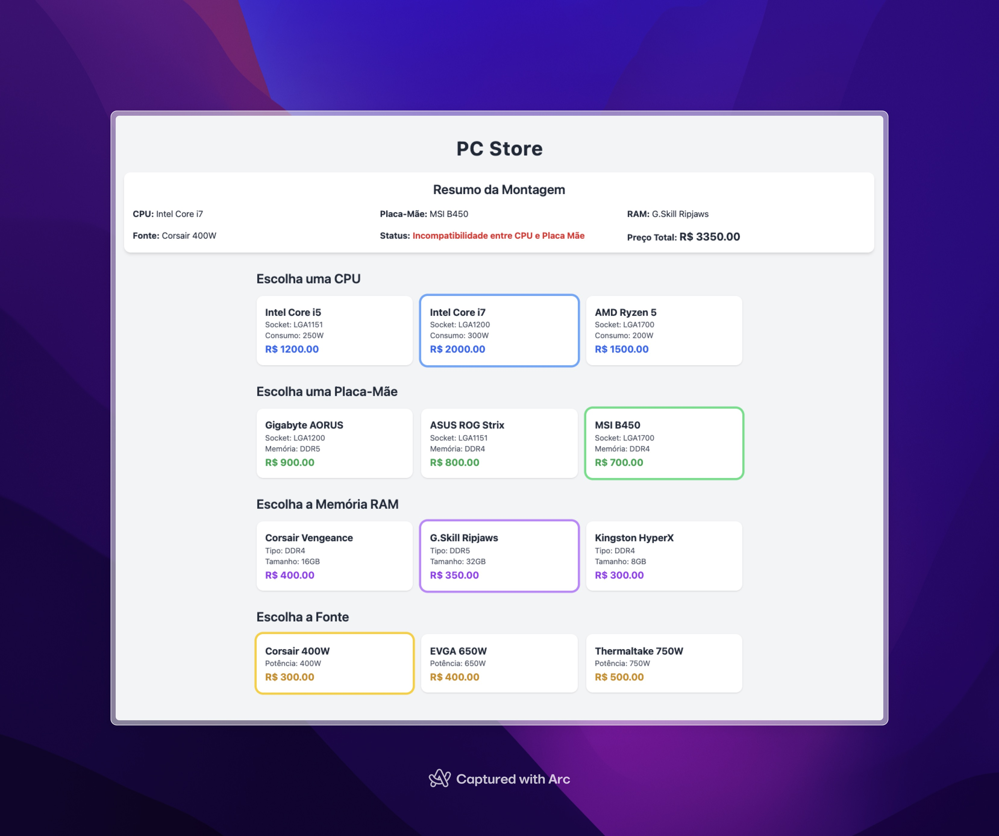

# Exercício: Pc Store



## Objetivo
O objetivo deste exercício é ensinar os conceitos de **composição** e **herança** em Java, aplicando-os na criação de um sistema para montar um computador. 
---

## Funcionalidades

- Seleção de componentes (CPU, Placa-Mãe, RAM, Fonte)
- Verificação de compatibilidade entre CPU e placa-mãe
- Verificação de compatibilidade entre RAM e placa-mãe
- Cálculo de consumo total e validação de potência da fonte
- Cálculo do preço total do computador
- Interface web simples usando Spring MVC com Thymeleaf

---

## Estrutura do Projeto

src/main/java/br/com/joaocarloslima/store

│

├─ controller

│ └─ StoreController.java # Controlador principal da aplicação

│

├─ model

│ ├─ Computador.java # Representa o computador montado

│ ├─ Componente.java # Classe base para componentes

│ ├─ Cpu.java

│ ├─ Fonte.java

│ ├─ PlacaMae.java

│ ├─ Ram.java

│ ├─ Socket.java # Enum de sockets compatíveis

│ └─ TipoMemoria.java # Enum de tipos de memória

│

└─ StoreApplication.java # Classe principal (Spring Boot)

---

## Descrição do Sistema
O sistema permite que o usuário monte um computador selecionando os seguintes componentes:
- **CPU**
- **Placa-Mãe**
- **Memória RAM**
- **Fonte de Alimentação**

Cada componente possui atributos específicos e deve ser representado como uma classe. Além disso, todos os componentes compartilham atributos comuns, que serão definidos em uma classe base chamada `Componente`.

---

## Requisitos do Exercício

### 1. Criar a Classe Base `Componente`
- A classe `Componente` será **abstrata** e conterá os seguintes atributos:
  - `Long id`: Identificador único do componente.
  - `String nome`: Nome do componente.
  - `int consumo`: Consumo de energia em watts.
  - `double preco`: Preço do componente.
- Adicione os métodos `getters` e `setters` para os atributos.

### 2. Criar as Classes Específicas
Implemente as seguintes classes que herdam de `Componente`:

#### **CPU**
- Atributo adicional:
  - `Socket socket`: Tipo de socket da CPU (enum).
- Construtor: Deve inicializar todos os atributos, incluindo os da classe base.

#### **Placa-Mãe**
- Atributos adicionais:
  - `Socket socket`: Tipo de socket suportado pela placa-mãe.
  - `TipoMemoria tipoMemoria`: Tipo de memória suportado (enum).
- Métodos:
  - `boolean compativel(Cpu cpu)`: Verifica se a CPU é compatível com a placa-mãe.
  - `boolean compativel(Ram ram)`: Verifica se a RAM é compatível com a placa-mãe.

#### **RAM**
- Atributos adicionais:
  - `TipoMemoria tipo`: Tipo de memória (enum).
  - `int tamanhoGb`: Tamanho da memória em GB.
- Construtor: Deve inicializar todos os atributos, incluindo os da classe base.

#### **Fonte**
- Atributo adicional:
  - `int potencia`: Potência da fonte em watts.
- Construtor: Deve inicializar todos os atributos, incluindo os da classe base.

### 3. Criar os Enums
Implemente os seguintes enums para representar os tipos de socket e memória:
- **Socket**:
  - `LGA1151`
  - `LGA1200`
  - `LGA1700`
- **TipoMemoria**:
  - `DDR4`
  - `DDR5`

### 4. Criar a Classe `Computador`
- Atributos:
  - `PlacaMae placaMae`
  - `Cpu cpu`
  - `Ram ram`
  - `Fonte fonte`
- Métodos:
  - `String status()`: Retorna o status do computador:
    - "Computador incompleto" se algum componente estiver faltando.
    - "Incompatibilidade entre CPU e Placa Mãe" se a CPU não for compatível.
    - "Incompatibilidade entre RAM e Placa Mãe" se a RAM não for compatível.
    - "Fonte insuficiente para o sistema" se a potência total dos componentes for maior que a potência da fonte.
    - "Computador completo e funcionando" se tudo estiver correto.
  - `double precoTotal()`: Calcula o preço total dos componentes.

---

---

## Como Executar

1. Clone o repositório:

```bash
git clone https://github.com/seu-usuario/StoreApplication.git

Entre na pasta do projeto:
cd StoreApplication

Execute a aplicação usando Maven ou seu IDE favorito (IntelliJ, Eclipse):
mvn spring-boot:run

Abra o navegador e acesse:
http://localhost:8080/

Selecione os componentes desejados e veja o status do computador atualizado em tempo real.
